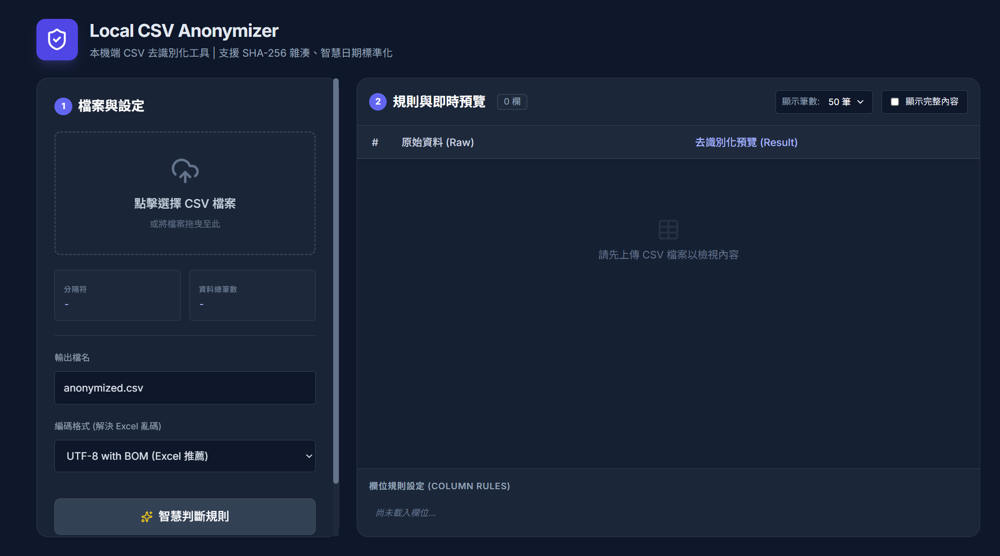

# 🛡️ Local CSV Anonymizer

**Local CSV Anonymizer** 是一個基於瀏覽器運作的輕量級 CSV 去識別化工具 (De-identification Tool)。

所有的資料處理皆在您的**本機端 (Client-side)** 完成，**資料絕對不會上傳至任何伺服器**。這使得它非常適合用於處理包含敏感個資（如 Email、身分證字號、電話）的資料集，確保在進行數據分析或第三方共享前的資安合規。


---



---

## ✨ 主要功能 (Features)

* 🔒 **100% 離線處理**：無後端伺服器，資料不離開您的電腦，徹底杜絕傳輸過程中的外洩風險。
* ⚡ **智慧規則判斷**：自動偵測 Email、身分證、電話與日期欄位，並推薦適合的處理規則。
* 🔐 **工業級雜湊**：採用瀏覽器原生 **Web Crypto API (SHA-256)** 進行不可逆雜湊處理。
* 📅 **智慧日期標準化**：內建 **Day.js**，能識別各種日期格式（如 `Jan 1 2024`, `2024/01/01`）並統一轉為 `YYYY-MM-DD`。
* 👀 **彈性預覽介面**：
    * 支援大筆數預覽（10 / 50 / 100 / 全部）。
    * **完整內容模式**：可展開長字串（如 Hash 值），不被截斷。
    * 凍結窗格 (Sticky Header) 設計，方便檢視。
* 📊 **Excel 友善匯出**：自動加入 BOM (`\ufeff`)，確保 Excel 開啟 CSV 時中文不亂碼。

---

## 🚀 快速開始 (Quick Start)

本專案為 **單檔 HTML (Single-file HTML)** 架構，無需安裝 Node.js 或 Python 環境。

### 方法 1：直接使用
1.  下載本專案中的 `index.html`。
2.  使用 Chrome / Edge / Firefox 瀏覽器直接開啟該檔案。
3.  拖曳您的 CSV 檔案進去即可開始使用。

### 方法 2：Clone 專案
```bash
git clone [https://github.com/your-username/local-csv-anonymizer.git](https://github.com/your-username/local-csv-anonymizer.git)
cd local-csv-anonymizer
# 直接用瀏覽器開啟 index.html

```

---

## 📖 使用教學 (Usage)

1. **上傳檔案**：拖曳或點擊選擇 CSV / TSV 檔案。
2. **智慧判斷**：點擊 **「✨ 智慧判斷規則」** 按鈕，系統會自動掃描內容並設定建議規則。
3. **手動微調**：
* **Keep (保留)**：不修改原始資料。
* **Mask (遮罩)**：隱藏部分資訊（如 `0912******88`）。
* **Hash (雜湊)**：使用 SHA-256 轉換為唯一識別碼（適用於 ID 類）。
* **Date (日期)**：標準化為 `YYYY-MM-DD`。
* **Empty (清空)**：移除該欄位內容。


4. **即時預覽**：在右側視窗確認處理結果，可切換「顯示完整內容」查看詳細 Hash 值。
5. **下載**：點擊 **「生成並下載」** 取得處理後的 CSV。

---

## 📂 專案結構

```text
local-csv-anonymizer/
├── index.html          # 核心程式 (All-in-One)
├── README.md           # 說明文件
├── LICENSE             # MIT 授權條款
└── samples/            # 測試用資料
    ├── employee_demo.csv   # 範例一：員工個資
    └── sales_demo.csv      # 範例二：訂單紀錄

```

---

## 🛠️ 技術棧 (Tech Stack)

* **UI Framework**: [Tailwind CSS](https://tailwindcss.com/) (CDN)
* **CSV Parser**: [PapaParse](https://www.papaparse.com/)
* **Date Utility**: [Day.js](https://day.js.org/)
* **Icons**: [Lucide](https://lucide.dev/)
* **Security**: Native Web Crypto API (SHA-256)

---

## ⚠️ 免責聲明 (Disclaimer)

* **關於雜湊 (Hashing)**：本工具使用 SHA-256 進行雜湊。雖然 SHA-256 目前被認為是安全的，但對於極高敏感度的資料（如金融帳戶、醫療紀錄），建議使用者自行評估是否需要加鹽 (Salting) 或進行更嚴格的去識別化處理。
* **合規性**：本工具協助進行資料去識別化，但使用者仍需自行確認處理後的資料是否符合 GDPR、CCPA 或當地個資法規的要求。

---

## 👨‍💻 作者

**Eason**
一位喜歡用自動化工具解決生活瑣事的資深工程師。

---

## 📜 License

[MIT](https://www.google.com/search?q=LICENSE)